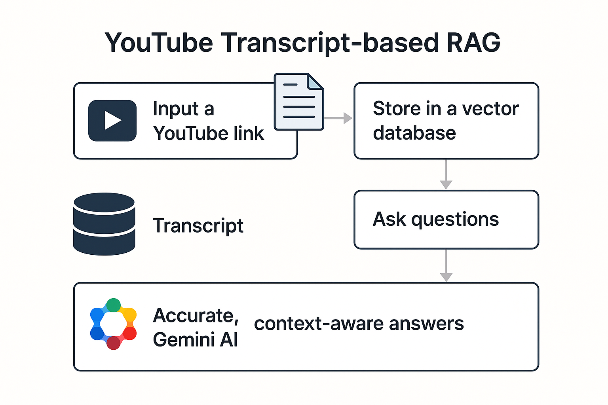
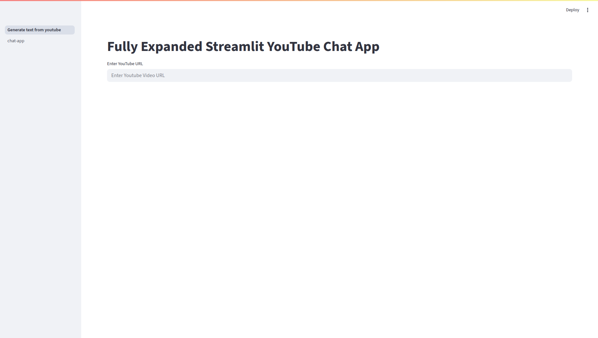
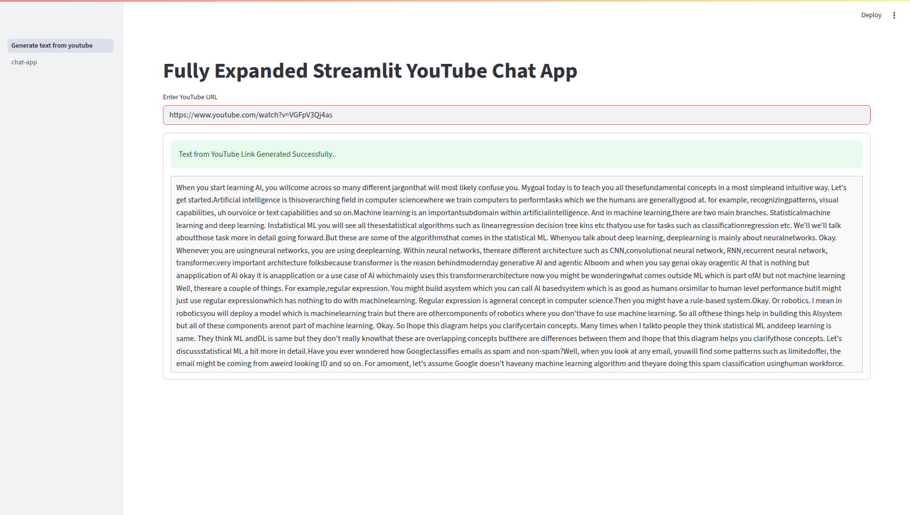
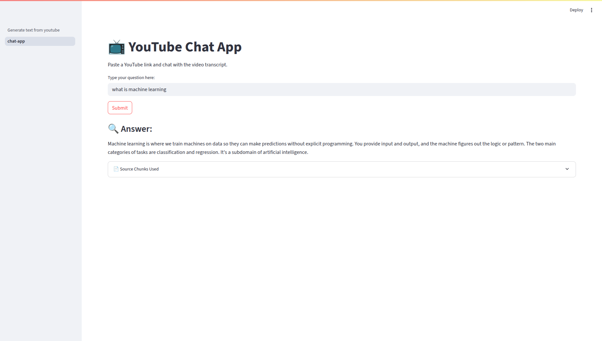

# 🧠 genai-rag-playground

A personal learning playground for building and experimenting with **Generative AI**, **RAG (Retrieval-Augmented Generation)** pipelines, and **Streamlit-based user interfaces**.

This repo includes multiple mini-projects and prototypes that demonstrate how to combine **LLMs**, **vector search**, and **external data sources** to create smart, context-aware applications.

---

## 🚀 Projects

| Folder | Description |
|--------|-------------|
| `simple-rag-app/` | Minimal RAG app using LangChain, Streamlit, and local documents |
| `streamlit-rag-app/` | UI experiments: layouts, widgets, rag-app & multi-page setup |
| `chromadb-experiments/` | quick start of vector db(chroma) |
<!-- | `youtube-chat-app/` | Ask questions about a YouTube video by extracting its transcript and running RAG | -->
<!-- | `components/` | Reusable Python modules: vector store, embeddings, prompts, etc. | -->
<!-- | `notebooks/` | Jupyter notebooks for testing LangChain, LLMs, and vector similarity search | -->

---

## 🔧 Tech Stack

- 🧩 LangChain
- 🧠 LLMs: OpenAI GPT-4, Gemini Pro, Claude (configurable)
- 📄 Vector DBs: ChromaDB
- 🌐 Streamlit
<!-- - 📺 YouTube Transcript API -->
- 📦 Python 3.10+

---

## 📦 Installation

```bash
# Clone the repo
git clone git@github-personal:ajeetcodes/genai-rag-playground.git
cd genai-rag-playground

# Create and activate virtual environment
python -m venv app-env
source app-env/bin/activate  # Windows: app-env\Scripts\activate

# Install dependencies
pip install -r requirements.txt


# 🎥 YouTube Chat RAG App | Gemini + LangChain + Streamlit

A GenAI-powered app that lets you chat with any **YouTube video** using its transcript.  
Built using:  
🧠 LangChain · 🤖 Gemini AI · 📦 ChromaDB · 🌐 Streamlit

> Paste a YouTube link → Extract transcript → Store in vector DB → Ask questions → Get smart answers!

---

## 🧠 How It Works



1. **Transcript Extraction**  
   Automatically fetch the transcript using the YouTube Transcript API.

2. **Text Splitting & Embedding**  
   The transcript is split into chunks and converted into vector embeddings.

3. **Store in Vector DB**  
   The chunks are stored in **ChromaDB** for semantic retrieval.

4. **Ask Questions**  
   You can now ask questions about the video.

5. **Generate Answers with Gemini**  
   Retrieved chunks are passed to **Gemini AI** to generate context-aware responses.

---

## ⚙️ Tech Stack

### 🧠 LangChain  
Open-source framework that helps manage chains, retrievers, and vector storage for LLM-powered apps.

### 🤖 Gemini AI (Google)  
Used for natural language understanding and generation based on the retrieved transcript context.

### 📦 ChromaDB  
An efficient, open-source vector store to save and retrieve semantic chunks.

### 🌐 Streamlit  
Fast and clean UI to build an interactive experience with sidebar navigation and chat interface.

---

# 📸 Screenshots

### 🔗 YouTube Input & Transcript  


### 📝 Transcript View  


### 💬 Chat Interface  


---

##

